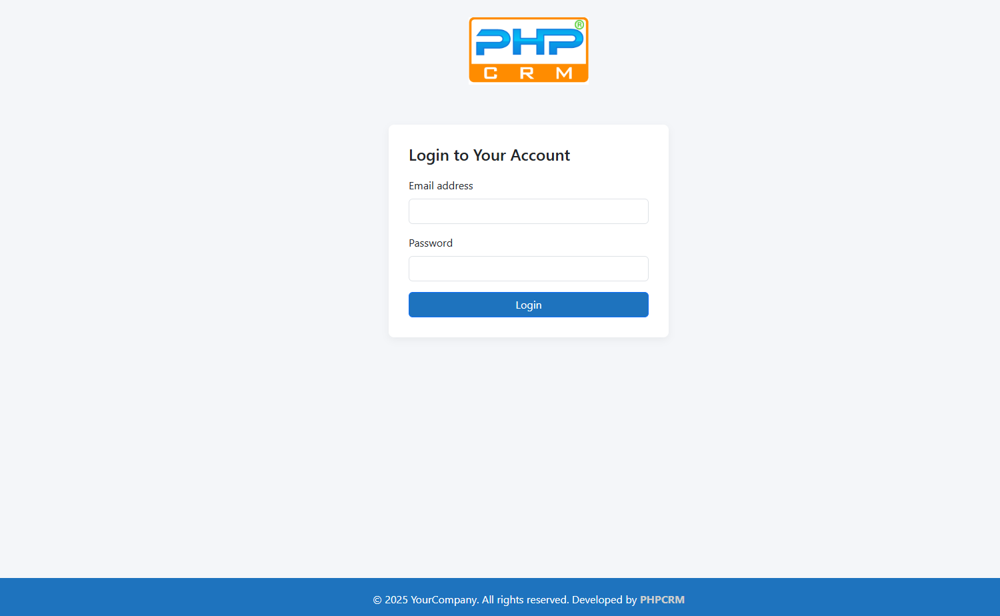

<h1 align="center">🚀 PHPCRM — Open Source CRM Software</h1>

<b>Self-hosted CRM to manage leads, customers, tasks & sales — free for commercial use.</b>

  <a href="https://www.phpcrm.com/download/"><b>📥 Download</b></a> •
  <a href="https://www.phpcrm.com/cloud/"><b>☁️ Cloud CRM</b></a> •
  <a href="https://www.phpcrm.com/crm-demo/"><b>👀 Live Demo</b></a> •
  <a href="https://www.phpcrm.com/contact/"><b>📩 Contact</b></a>

Website URL: https://www.phpcrm.com
---

## 🔥 About PHPCRM

PHPCRM is a powerful web-based Customer Relationship Management (CRM) software offered in two editions —  
**PHPCRM Open-Source (free, self-hosted)** and **PHPCRM Cloud (premium, fully hosted).**

### 🟢 PHPCRM Open-Source (Free Edition)
Ideal for businesses and developers who want a CRM solution that is:
- ✔ Free to use & modify  
- ✔ Fully customizable & self-hosted  
- ✔ Lightweight & scalable  
- ✔ No monthly subscription fees  

It includes core CRM modules:
leads, customers, follow-ups, notes, tasks, reminders, login system and dashboard metrics.

### 🔵 PHPCRM Cloud (Premium Edition)
Designed for businesses that want a ready-to-use CRM without technical maintenance.  
It includes everything in the open-source edition plus:
- 🔐 Secure hosting
- 🧩 Advanced CRM modules
- 📦 Automatic updates
- 🛡 Daily backup & monitoring
- 🧑‍💻 Full maintenance handled by the PHPCRM team

👉 Self-host if you prefer control & customization  
👉 Use Cloud if you need a zero-maintenance solution

---

## 🌟 Key Features / Modules

### CRM & Sales
- Lead management
- Customer management
- Customer pipeline tracking
- Conversion workflow

### Tasks & Activities
- Notes & call logs
- Task / follow-up scheduling
- Activity timeline history

### Dashboard & Performance
- Lead analytics
- Activity stats
- Overview of daily CRM operations

### Authentication & Security
- Secure login
- Password change
- Session protection

---

## 🧭 Who Can Use PHPCRM?

Suitable for:
| Category | Use-Case |
|----------|----------|
| IT Agencies | Deploy CRM for clients |
| Software Companies | Build SaaS solutions |
| Freelancers | Sell customized CRM |
| Businesses | In-house lead & customer tracking |
| Startups | CRM without recurring cost |

Industries that benefit most:
🏨 Hotels • 🏠 Real Estate • 🧾 Contractors • 🚖 Taxi • 🏥 Clinics • 📚 Education • 🚗 Car Rentals • 🧾 Insurance • Many more

---

## 🛠 Technology Stack

| Component | Specification |
|----------|---------------|
| Backend | PHP 7.4+ (PHP 8+ recommended) |
| Database | MySQL / MariaDB |
| Architecture | MVC (Custom PHP — No Framework Required) |
| Frontend | Bootstrap 5 |
| DB Driver | mysqli |
| Hosting | Shared / VPS / Cloud / Localhost |

---

## 📥 Installation Guide

1️⃣ Extract the CRM into web directory  
2️⃣ Create a new MySQL database  
3️⃣ Import SQL → `/database/phpcrm_install.sql`  
4️⃣ Update DB config → `/app/config/database.php`  
5️⃣ Open the CRM in your browser:  localhost/your-folder/public/

---

## 🔑 Default Admin Login

| Field | Details |
|-------|---------|
| Email | admin@phpcrm.com |
| Password | 123456 |

⚠️ For security, change the password after first login.

---

## 📸 Screenshots

### 🔐 Login Screen

### 📊 Dashboard

### 🧲 Leads Module

### 👥 Customers Module

### 🗓 Tasks & Follow-ups

### 👤 User Profile / Settings (optional)

